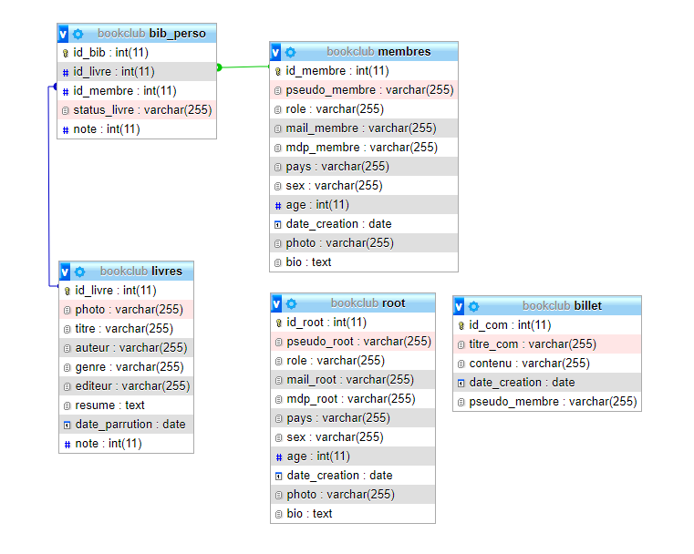

# Projet Web :

Le site se compose des pages, boutons et fonctionnalitées suivantes :

- Accueil (index.html)
- Inscription
- Connexion
- Home (home.php)
- A propos
- Communauté
- Recherche avec filtres
- Messages
- Profil membre
- Profil admin
- Modification profil membre
- Ajout photo membre
- Deconnexion
- Contenu Personnalisé
- Page Root
- Suppression Compte membre
- Moderation membres
- Modération livres
- CRUD livres
- Ajout livres
  
## Pour importer la Base de Données et démarrer:

Lancer XAMPP

Activer le serveur Apache et sql

Aller sur la page phpmyadmin

Clique sur "Importer"

Choisir le fichier bookclub.sql

Ouvrir une nouvelle page et saisir :
http://localhost:8080/TP/Projet_Web/html/index.html

## Connexion:

On peut se connecter depuis un seul et même endroit avec les logins de la BDD,
c'est a dire que root peut se connecter sur le même formulaire de connexion qu'un membre.

## Identifiants:

- ROOT :
Pseudo = vinny
mdp = dbz

- Membres:
Pseudo = jean
mdp = jean

Pseudo = Morgan
mdp = alcool

Pseudo = milou
mdp = milou

Pseudo = lisa
mdp = lisa

## Base de donnée

La base de donnée se présente sous la forme ci-dessous:

C'est avec cette structure que le site "Bookclub peut fonctionner.

## Technologies utilisées

Les technologies utilisées lors de ce projet se limitent au 4 langages du web: HTML, CSS, JAVASCRIPT et PHP. Quelques logiciels ou applications tel XAMPP ou GIT, pour ne citer que ceux-ci, nous on respectivement aidé à simuler le fonctionnement du site en local (sans serveur externe) et partager notre travail au sein du groupe sur un dépot attribué.

## Tâches non fini:

- Contenu personalisé en fonction des gout du membre(Home)
- Système d'envoi de mail(connexion & Home)
- Système de messagerie(Communauté)
- Bibliothéque personnelle(Profil)
- Formulaire de requête d'ajout de livre(Home)
- Ajout d'amis(Communauté)
- Affichage des membres la communauté(Communauté)
- Messages privés
- Page à propos